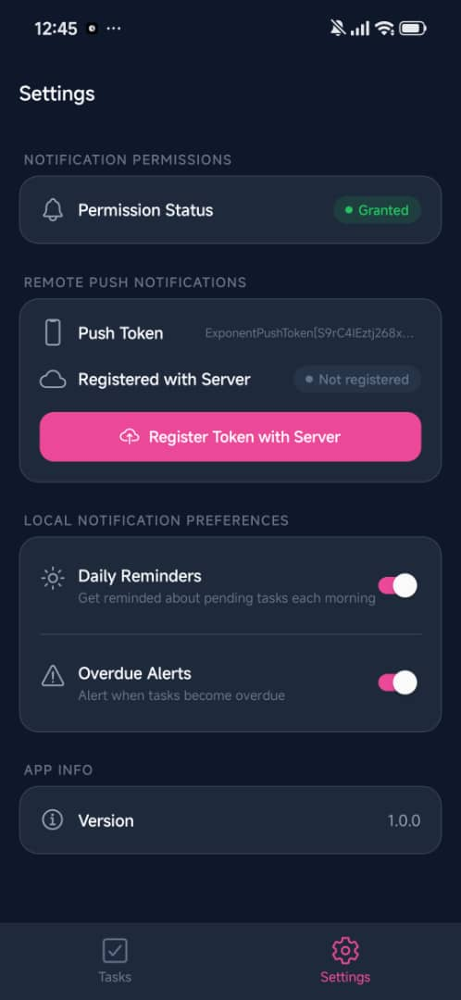
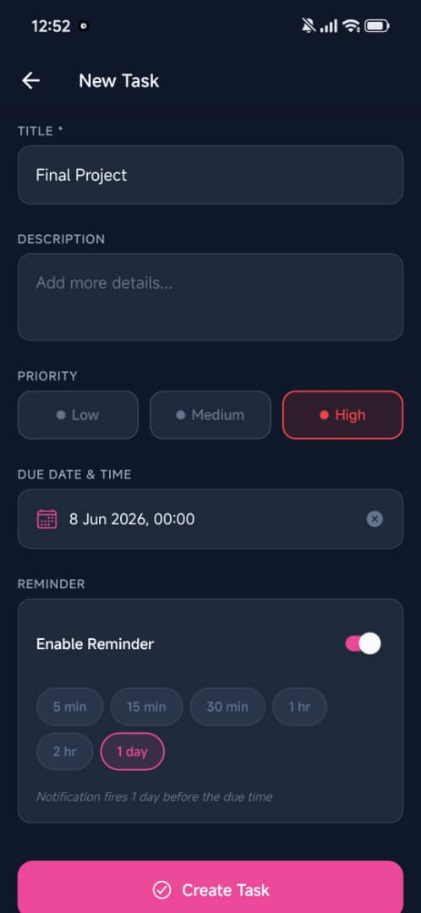
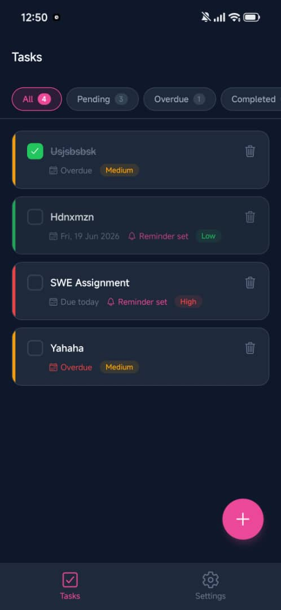
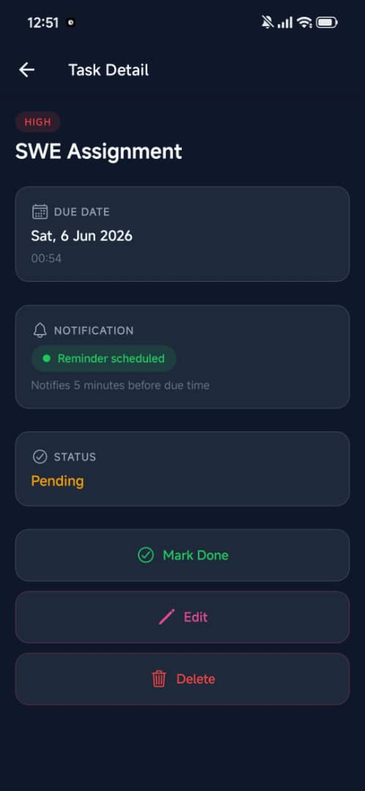
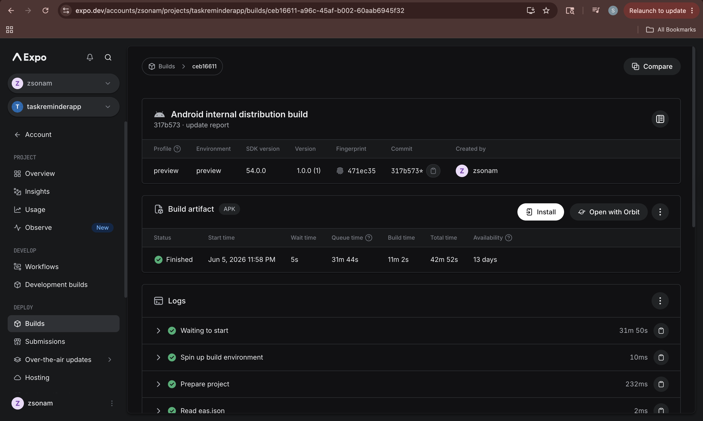

# TaskReminderApp

A React Native task reminder app with local and remote push notifications.

## Project Structure

```
TaskReminderApp/
├── frontend/    # Expo React Native app (TypeScript)
├── backend/     # Node.js/Express + SQLite push notification server
├── screenshots/ 
└── README.md    
```

## Quick Start

1. Start the backend first - see `backend/README.md`
2. Set the frontend `.env` with your backend URL
3. Start the frontend - see `frontend/README.md`

## Notification Flows

| Type | Trigger | Channel |
|------|---------|---------|
| Local reminder | X minutes before task due date (on-device) | `task-reminders` |
| Remote task reminder | Backend → Expo Push API → device | `task-reminders` |
| Remote broadcast | Backend → all registered devices | `task-reminders` |
| Overdue alert | Configurable, higher urgency | `overdue-alerts` |

## Notification Handling

| App State | Behavior |
|-----------|----------|
| Foreground | Banner shown via `setNotificationHandler` |
| Background / Closed | System tray notification |
| Tapped | Navigates to the relevant task detail screen |

## Screenshots

### 1. Notification Permission / Settings Screen



### 2. New Task Screen



### 3. Task List Screen



### 4. Task Detail Screen



### 5. Notification 


## Notes
- Expo push tokens are only available on physical devices
- EAS build is configured for Android only



